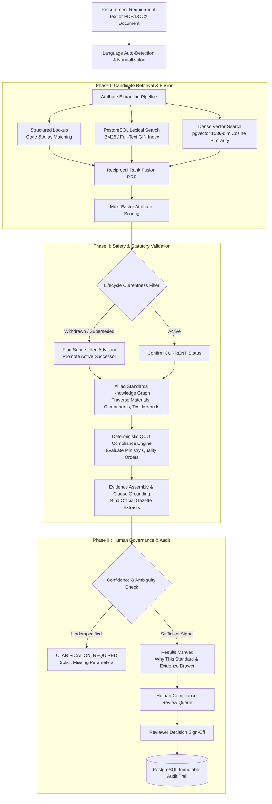

# NormWise: Recommendation Engine Pipeline Architecture

**Document Version:** 1.0.0 (SIH 2024 Final Submission)  
**System Module:** `server/src/services/recommendationService.js`  

---

## 1. Architectural Distinction: Retrieval vs Validation vs Decision

A foundational engineering principle of NormWise is the strict separation of concerns between three core phases:

```text
┌─────────────────────────────────────────────────────────────────────────────┐
│                            PHASE I: RETRIEVAL                               │
│   (Probabilistic & Algorithmic Candidate Discovery)                         │
│   • Multilingual Normalization (Indic -> English Terminology)               │
│   • Attribute Extraction (Product, Material, Application, Ratings)          │
│   • 3-Way Candidate Search (Structured + Lexical BM25 + pgvector Dense)     │
│   • Reciprocal Rank Fusion (RRF) & Multi-Factor Scoring                     │
└──────────────────────────────────────┬──────────────────────────────────────┘
                                       │ Raw Ranked Candidates
                                       ▼
┌─────────────────────────────────────────────────────────────────────────────┐
│                            PHASE II: VALIDATION                             │
│   (Deterministic Statutory & Safety Gatekeepers)                            │
│   • Currentness Filter (Enforce Active Standard; Flag Superseded/Withdrawn) │
│   • Knowledge Graph Traversal (Retrieve Allied Materials & Components)      │
│   • Deterministic Compliance Engine (Check Statutory QCO Orders)            │
│   • Evidence Traceability (Bind Clauses & Official Gazette Citations)       │
└──────────────────────────────────────┬──────────────────────────────────────┘
                                       │ Validated & Grounded Recommendations
                                       ▼
┌─────────────────────────────────────────────────────────────────────────────┐
│                           PHASE III: HUMAN DECISION                         │
│   (Human-in-the-Loop Governance & Audit Persistence)                        │
│   • Ambiguity & Clarification Routing (Ask Missing Specs if Underspecified) │
│   • Technical Reviewer Queue (Inspect Normative Excerpts & Checklists)      │
│   • Formal Reviewer Sign-off (APPROVE / REJECT / NEEDS_REVISION)            │
│   • Immutable Statutory Audit Trail (PostgreSQL AuditEvent)                 │
└─────────────────────────────────────────────────────────────────────────────┘
```

---

## 2. End-to-End Pipeline Data Flow



---

## 3. Pipeline Stage Breakdown

### Stage 1: Language Normalization & Attribute Extraction
- **Input:** Raw user text, tender paragraph, or parsed PDF/DOCX schedule.
- **Processing:** Translates Indic input (Hindi, Marathi, Bengali) to standardized technical terminology.
- **Extraction:** Maps attributes into structured JSON (`product`, `material`, `application`, `capacity`, `technicalCharacteristics`, `intendedUse`).

### Stage 2: Three-Way Hybrid Candidate Generation
- **Structured Search:** Queries exact match on `codeNumber` or product alias.
- **Lexical BM25 Search:** Executes PostgreSQL full-text search with English configuration dictionaries.
- **Vector Search:** Embeds requirement into vector space and computes cosine distance ($1 - \text{cosine\_distance}$) via `pgvector`.
- **RRF Merge:** Fuses candidates:
  $$\text{RRF Score}(d) = \sum_{m \in \{\text{structured, lexical, vector}\}} \frac{w_m}{k + \text{rank}_m(d)}$$

### Stage 3: Currentness Safety Gatekeeper
- Validates the standard's current lifecycle status (`CURRENT`, `SUPERSEDED`, `WITHDRAWN`, `UNDER_REVIEW`).
- **Core Invariant:** If an outdated standard (e.g. `IS 2347:2014`) matches well, NormWise flags it, promotes the active successor (`IS 2347:2023`), and issues a supersede alert.

### Stage 4: Knowledge Graph Traversal
- Queries the relational `RelatedStandard` table to surface:
  - **Material Standards** (e.g. `IS 6911:2017` Stainless Steel)
  - **Component Standards** (e.g. `IS 7466:1994` Rubber Gaskets)
  - **Test Methods & Safety Standards**

### Stage 5: Deterministic QCO Compliance Evaluation
- Evaluates statutory Quality Control Orders published by ministries (e.g. *Domestic Pressure Cookers QCO 2020*).
- Deterministic rule logic checks whether certification (ISI Mark / Scheme-I) is legally compulsory.

### Stage 6: Evidence Assembly & Traceability
- Compiles exact normative clause references, titles, and verified text excerpts. Zero synthetic clauses.

### Stage 7: Human Governance & Audit Trail
- Forwards recommendation to the Human Compliance Review Queue (`/review`).
- Technical reviewers verify checklist items and record formal sign-off.
- System logs tamper-evident audit record in PostgreSQL.
